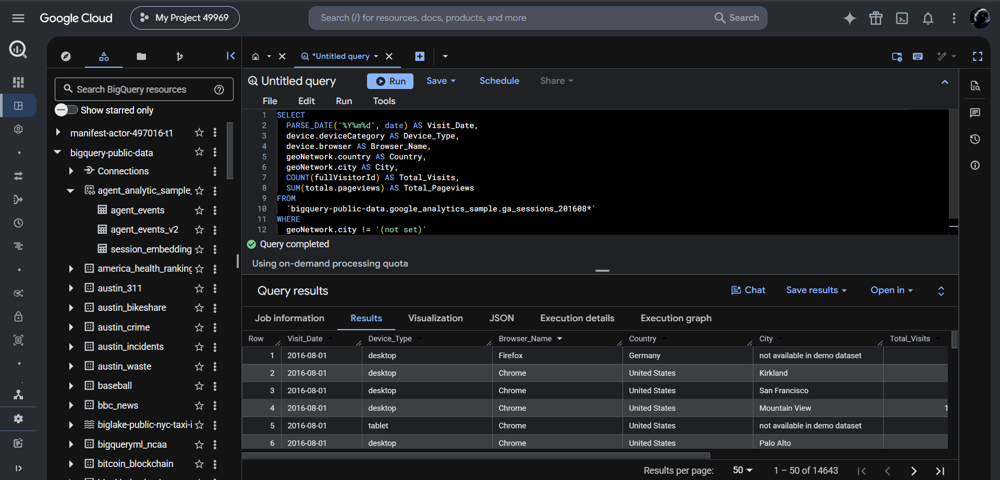
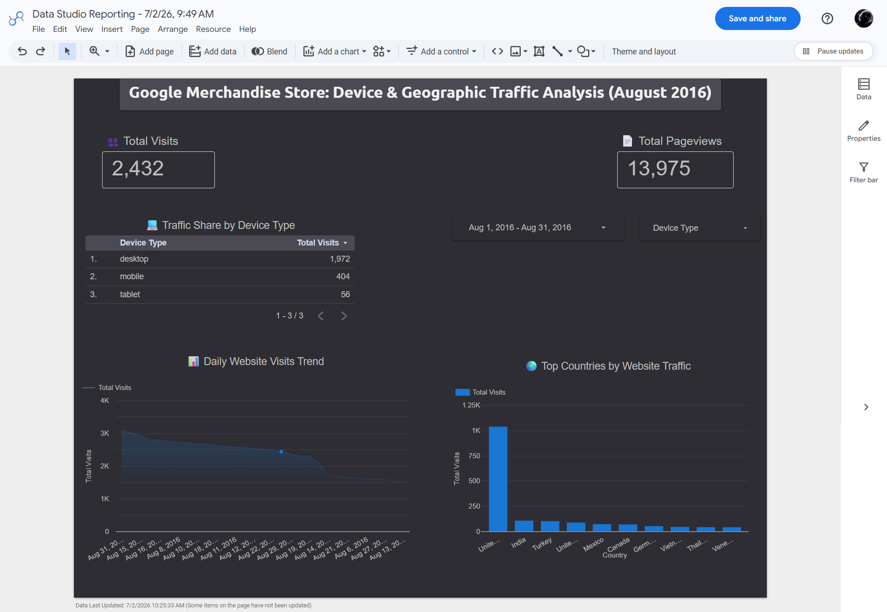

# Google Merchandise Store: Device & Geographic Traffic Analysis


---

## What's this about

Google has this public GA360 dataset sitting in BigQuery that anyone can query for free. Real web analytics data from their merchandise store — sessions, devices, geography, pageviews, the whole thing.

So instead of downloading a CSV and doing the usual local stuff, I queried it directly in BigQuery, wrote a proper SQL query with wildcard tables and date parsing, and built a dashboard in Looker Studio on top of it.

Went smoothly. Mostly. There was one incident. We'll get to that.

---

## Architecture

```
BigQuery Public Dataset
(bigquery-public-data.google_analytics_sample)
         │
         │  SQL — wildcard tables, _TABLE_SUFFIX, PARSE_DATE
         ▼
   Query Results — 14,643 rows (August 2016)
         │
         │  Looker Studio native BigQuery connector
         ▼
   Dashboard — dark theme, KPIs, charts, device table
```

---

## The SQL Query

```sql
SELECT
  PARSE_DATE('%Y%m%d', date) AS Visit_Date,
  device.deviceCategory AS Device_Type,
  device.browser AS Browser_Name,
  geoNetwork.country AS Country,
  geoNetwork.city AS City,
  COUNT(fullVisitorId) AS Total_Visits,
  SUM(totals.pageviews) AS Total_Pageviews
FROM
  `bigquery-public-data.google_analytics_sample.ga_sessions_*`
WHERE
  _TABLE_SUFFIX BETWEEN '20160801' AND '20160831'
  AND geoNetwork.city != '(not set)'
GROUP BY
  Visit_Date, Device_Type, Browser_Name, Country, City
ORDER BY
  Visit_Date ASC;
```

**What's happening here:**

- `ga_sessions_*` — GA360 stores data in daily sharded tables. The wildcard hits all of them at once instead of querying each date manually like a maniac
- `_TABLE_SUFFIX BETWEEN '20160801' AND '20160831'` — tells BigQuery to only scan August 2016 tables. Without this, it'd scan everything and your free quota would cry
- `PARSE_DATE('%Y%m%d', date)` — the raw date column is a string like `20160801`. This turns it into an actual date so Looker Studio doesn't plot it like a random number
- `geoNetwork.city != '(not set)'` — removes rows where city wasn't captured. Cleaner to filter in SQL than deal with it in the dashboard layer
- `COUNT(fullVisitorId)` — total sessions per group
- `SUM(totals.pageviews)` — total pages viewed

---

## BigQuery in Action



Query completed. 14,643 rows returned. On-demand processing. Cost — basically $0.

---

## Dashboard



Dark theme. KPI scorecards up top, device breakdown table on the left, daily trend line chart bottom left, top countries bar chart bottom right.

---

## Numbers

| Metric | Value |
|--------|-------|
| Total Visits | 2,432 |
| Total Pageviews | 13,975 |
| Desktop | 1,972 |
| Mobile | 404 |
| Tablet | 56 |

Desktop is doing all the heavy lifting — 81% of traffic. Mobile at 17%, tablet barely showed up at 2%.

United States dominates by a huge margin. India is second, then Turkey, UK, Mexico. Everyone else is just noise on the bar chart.

Daily visits trend downward through August — strong first week, then a steady drop toward month end.

---

## The Incognito Chronicles

*If you're wondering why you're looking at a screenshot (`Dashboard.png`) instead of a live Looker Studio link — sit down, grab some water, this is a story.*

**Act 1 — The Smart Move**

My normal Chrome window was lagging badly. Too many extensions fighting with BigQuery and Looker Studio at the same time. Tabs freezing, UI stuttering, the whole drama.

So I did what any reasonable person would do — opened an Incognito window. Clean, lightweight, zero extension interference. Performance instantly improved. Dashboard was flying.

I felt like a genius. Briefly.

**Act 2 — The "wait... WHAT" Moment**

Spent hours on the dashboard. Dark theme. Custom KPIs. Proper alignment. Even added emojis for visual hierarchy (📈 🌍 💻 👥 📄 — yes, intentional, no I don't regret it).

Was literally about to hit Save and Share.

And then.

The incognito session reset.

UI layout — gone. Just... gone. Vaporized. The data was fine, the query was fine, but the entire dashboard layout had left the chat without saying goodbye.

*That specific "I forgot Incognito doesn't save anything" moment? Yeah. That one hits different at 11 PM.*

**Act 3 — The Rescue**

Didn't panic. Treated it like a debugging problem.

Went into the screenshot extension's active URL log, pulled the raw metadata encoded in the URL string, and reverse-engineered the entire BigQuery SQL query from it.

SQL — rescued. Logic — intact. Dashboard UI — still resting in peace.

The screenshot (`Dashboard.png`) you see above was taken right before the crash. It's the only survivor.

**The rule that got added to my personal Book of Errors:**

> *Incognito is great for beating browser lag. It is NOT for building dashboards without saving your work first. Incognito is for flights and sketchy searches, not production work.*

---

## What I Learned

- GA360 data in BigQuery uses daily sharded tables — `ga_sessions_*` + `_TABLE_SUFFIX` is the right approach, not querying each table one by one like it's 2010
- `PARSE_DATE` is non-negotiable if you want dates to behave like dates in Looker Studio
- Filtering `(not set)` cities in SQL is cleaner than handling it at the dashboard layer
- Desktop dominated web traffic in 2016 — mobile existed but hadn't taken over yet
- Looker Studio's native BigQuery connector is genuinely fast and zero setup
- And most importantly — Incognito has no memory, no mercy, and absolutely no interest in your dashboard layout. Save your work. Always.

---

## Files

```
├── analysis_query.sql     # The BigQuery SQL query
├── Dashboard.png          # Dashboard screenshot (the survivor)
├── BigQuery.png           # BigQuery query + results screenshot
└── README.md
```

---

**Ashutosh Saini**
Data Analyst | SQL · BigQuery · Looker Studio · Power BI · AWS

[](https://linkedin.com/in/ashutosh-flow)
[](https://github.com/InsightsByAsh)

